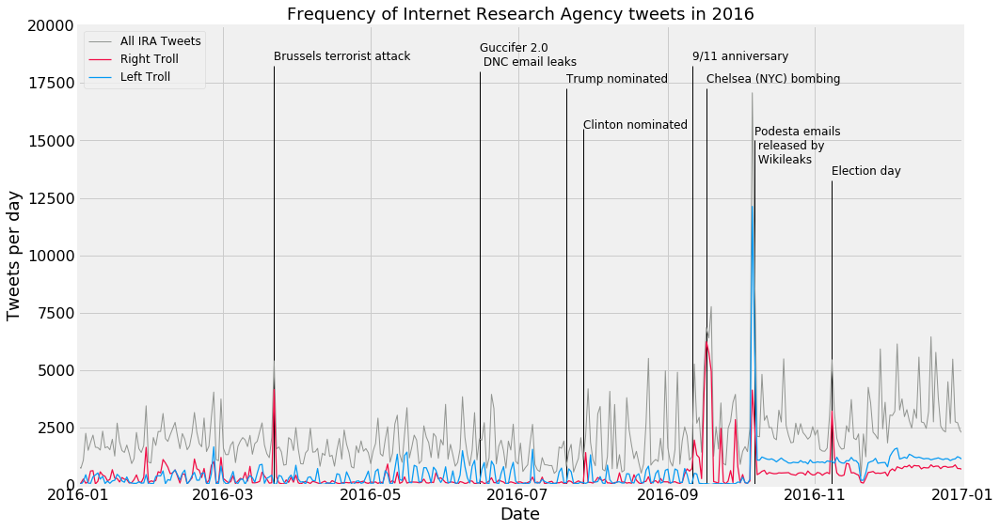

Millions of tweets. Thousands of fake accounts. A sophisticated disinformation campaign.  

In this work, I use natural language processing tools to profile nefarious Twitter 'sockpuppet' accounts.

View my work on my [Github repository](https://github.com/gcdunn/twitter-sockpuppet-nlp).

Watch my presentation at the [May 2019 Nashville Data Science Meetup](https://www.youtube.com/watch?v=UhyIM19DcT4&feature=youtu.be&ab_channel=DataScienceNashville).